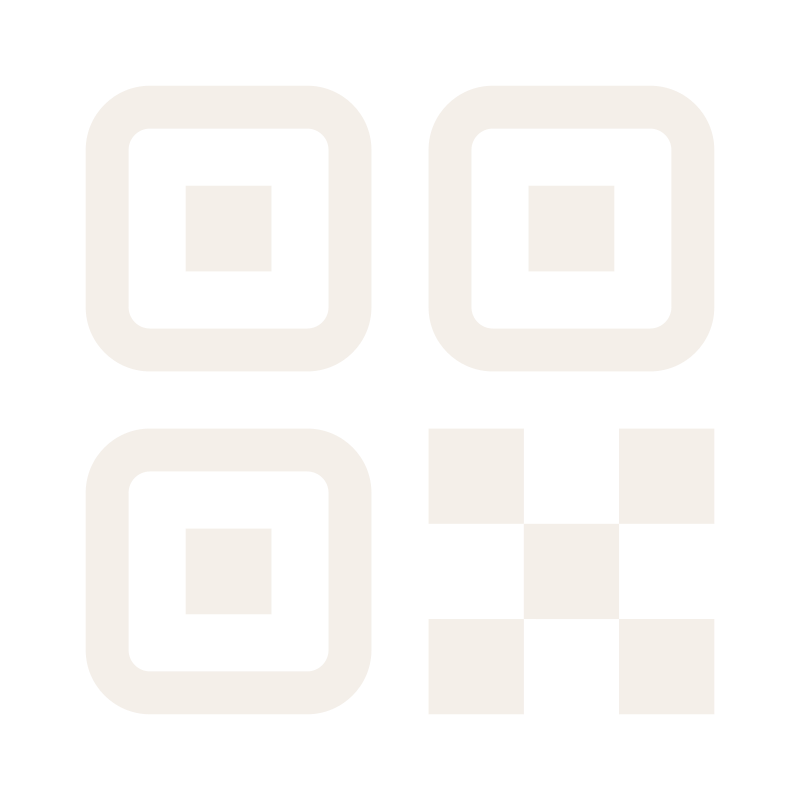

# Qraft: Generador de códigos QR con identidad de marca



**Qraft** genera códigos QR que extraen automáticamente los colores y el favicon de cualquier web — sin backend, sin cuenta, sin datos guardados.

## Por qué existe

Un código QR genérico no dice nada de quien lo pone. Qraft coge la identidad visual de una URL y la aplica al código: el color principal pasa a ser el color de los puntos, el favicon se incrusta y el fondo se adapta al tono más claro de la paleta.

## Dos modos

**Favicon en el centro** — usa `qr-code-styling` con corrección de errores nivel H, que aguanta hasta un 30% de la superficie tapada sin perder legibilidad. El favicon va centrado en esa zona.

**Favicon como puntos** — los módulos centrales del QR se sustituyen por el favicon binarizado con el método de Otsu a 64×64. El mapeo es módulo a módulo, respetando siempre los patrones de esquina y los marcadores de alineación, que son intocables para cualquier lector QR.

## Cómo se extraen los colores

El favicon se pide a 256×256 a través de la API de Google, con wsrv.nl como proxy para evitar problemas de CORS. ColorThief saca 8 colores, se filtran los que tienen poco contraste con el fondo, se eliminan duplicados por luminancia y se dejan un máximo de 4 opciones. El de mayor contraste se selecciona solo.

## Stack

- **Framework**: Astro 4 con isla React para la parte interactiva
- **Estilos**: Tailwind CSS v3, JetBrains Mono + Fraunces
- **QR**: `qrcode-generator` (matriz) + `qr-code-styling` (modo central)
- **Colores**: ColorThief con filtrado y deduplicación propios
- **Exportación**: PNG desde Canvas API, SVG generado a 1000×1000 por separado

## Correr en local

```bash
npm install
npm run dev
```

`npm run build` genera la salida estática. No hace falta ninguna variable de entorno.

---

Hecho por [Álvaro Lostal](https://lostal.dev)
